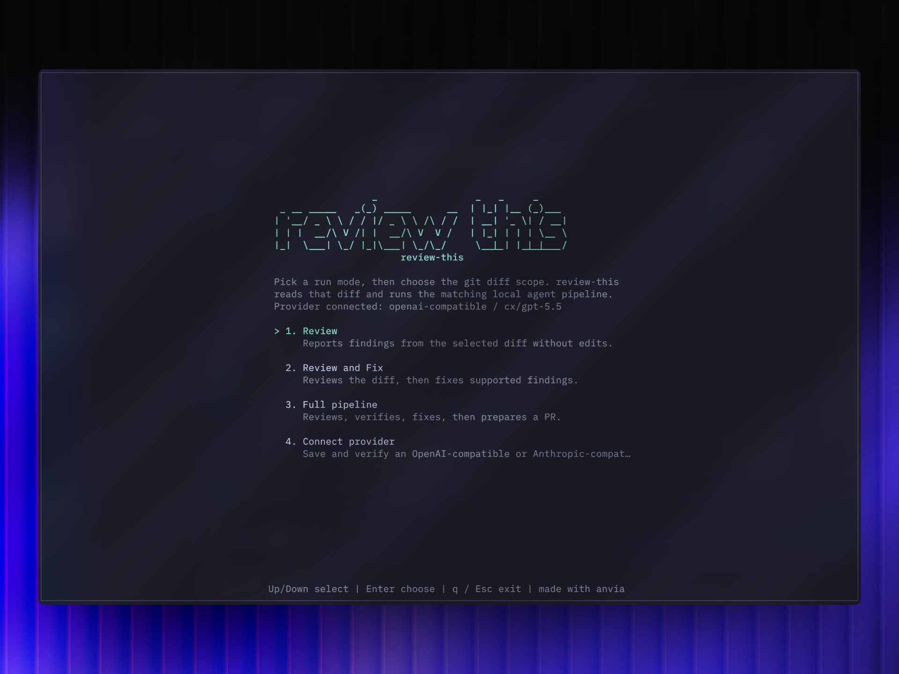

# review-this

`review-this` is a local CLI for agentic code review. It reviews the current git
diff, runs verification, applies focused fixes when needed, prepares a PR, and
monitors failing PR checks for repair.



## Why I Built This

I built `review-this` because human review is becoming the bottleneck in
agentic coding. Agents can write, revise, and verify changes quickly, but a
human still gets pulled into the loop too early when the work is not actually
ready to review.

This tool pushes that loop back to the agents. It starts from the current git
diff, asks an agent to review the change, runs project verification, applies
focused fixes when needed, prepares a PR only after the automated pipeline is
satisfied, then monitors the PR and gives agents a bounded repair loop for
failing checks.

The goal is for me to review once: when the PR is ready. Human attention should
go to the final decision, product judgment, and deeper engineering tradeoffs,
not to repeatedly catching issues an agent could have found and fixed locally.

## Workflow

- `Review`: review, then run available typecheck, tests, and build without edits.
- `Review and Fix`: review, verify, fix supported issues, then verify again.
- `Full pipeline`: review, verify, fix, prepare a PR, then monitor and repair
  failing PR checks when possible.

Run it from the repository you want reviewed:

```sh
review-this
```
